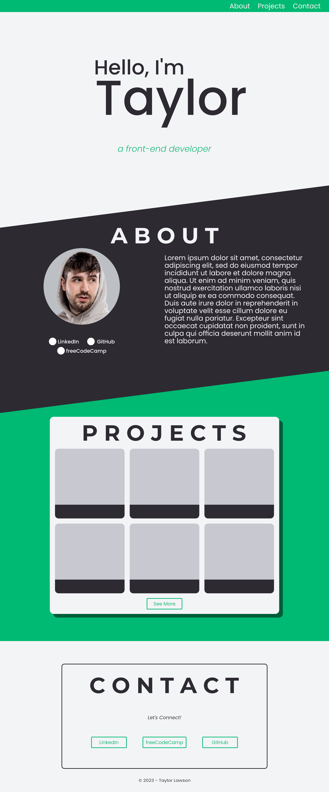

# Web dev portfolio site

This is site is used as a personal portfolio to document various coding projects I've worked on.

## Table of contents

-   [Overview](#overview)
    -   [Screenshot](#screenshot)
    -   [Links](#links)

## Overview

### About

This site began as the final projecet for freeCodeCamp's [Responsive Web Design](https://www.freecodecamp.org/certification/TypicalT/responsive-web-design) course, but I wanted to revisit this and continue to make it better as I learned more about web design tricks. I plan to continue updating and refining the existing code as well as implement cool features I discover that could add a bit of flare to the site.

### Screenshot

This is a mockup design I created in Affinity Photo to better visualize what I wanted the main desktop view of my redesign to look like.

### Links

-   Live Site URL: [Click Here](https://imtypicalt.github.io/portfolio/)
